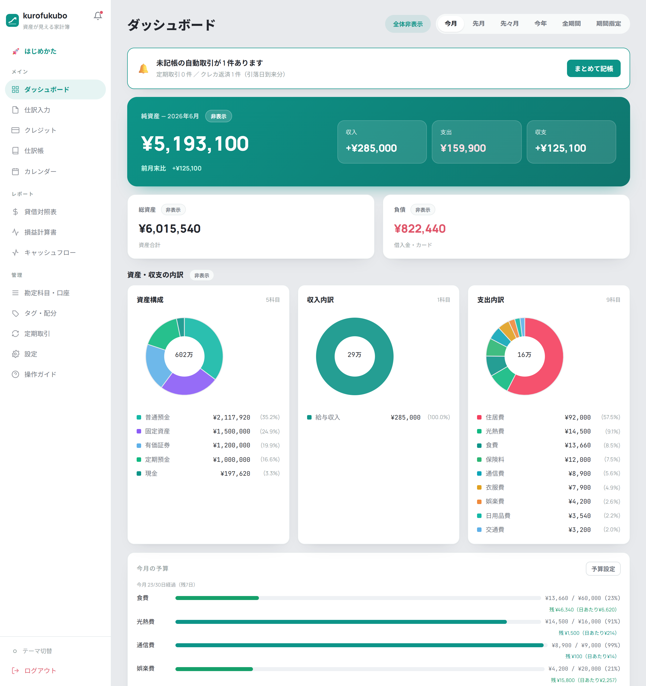
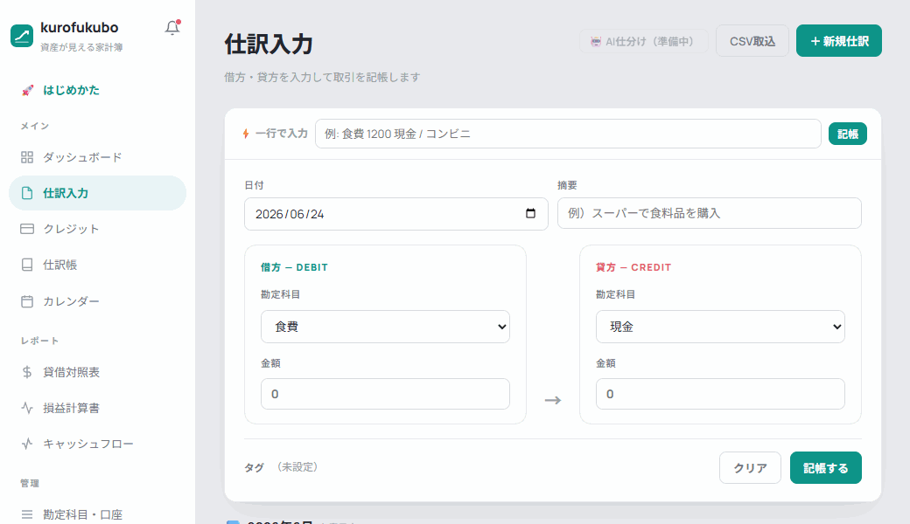
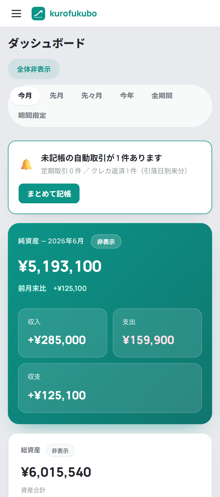
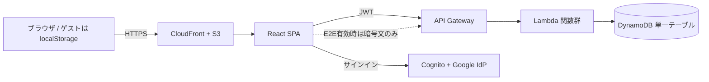
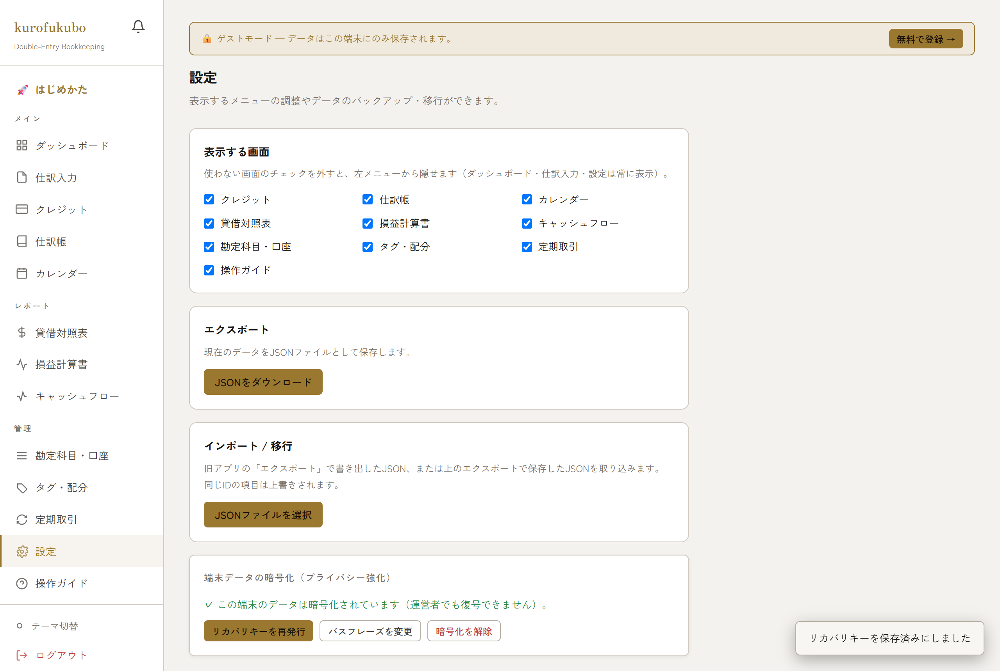

# kurofukubo（黒福簿）

**純資産まで見える、銀行と連携しない複式簿記ベースの家計簿 SaaS。**
現金・預金・証券・NISA・iDeCo・ローンまで含めた“純資産”を自動で可視化し、データは運営者にも中身が見えない **ゼロ知識 E2E 暗号化**に対応した、プライバシー重視の個人開発プロダクトです。

🌐 **アプリ**: https://app.kurofukubo.com/?utm_source=github&utm_medium=readme （登録不要のゲストモードで即試用可）
📄 **ランディング / ガイド**: https://kurofukubo.com/?utm_source=github&utm_medium=readme



---

## ✨ 特徴

- **純資産が一目** — 資産 − 負債（投資の含み益・ローンまで込み）の“正味の財産”を自動計算し、推移グラフで「増えているか」を毎月確認。
- **複式簿記エンジン** — 借方・貸方の一致を自動チェック。貸借対照表(BS) / 損益計算書(PL) / キャッシュフロー計算書を自動生成。
- **摩擦の少ない入力** — 「`食費 1200 現金`」の一行入力で自動仕訳化、かんたん入力モード、プリセット、CSV 取込（**マネーフォワード / Zaim の CSV も自動判定**）。
- **銀行連携なし** — 手入力 / CSV のみ。口座情報を預けない設計。
- **ゼロ知識 E2E 暗号化（オプトイン）** — パスフレーズ由来の鍵で端末内暗号化。サーバーは暗号文しか保持しません。
- **ゲストモード** — アカウント登録なしで全機能を試用（データは端末の localStorage のみ）。
- **データ所有** — 全データを JSON でエクスポート / インポート。ベンダーロックインなし。

<p>
  
  
</p>

---

## 🧱 技術スタック

| 層 | 採用技術 |
|---|---|
| フロントエンド | React 18 + Vite（SPA）、CSS 変数ベースのテーマ、**第三者トラッカーなし** |
| バックエンド | AWS SAM — API Gateway + Lambda（Node.js / ESM）+ DynamoDB（シングルテーブル設計）+ Cognito（メール + Google IdP / OAuth） |
| インフラ | S3 + CloudFront（OAC）、Route 53 + ACM、**マルチアカウント分離**（dev / prod、AWS Organizations + IAM Identity Center） |
| 暗号 | Web Crypto API、AES-256-GCM、PBKDF2-SHA256（60万回）、エンベロープ暗号（DEK / KEK）、リカバリーキー |

---

## 🏗 アーキテクチャ



- テナント分離は `PK = USER#<sub>` で実施。仕訳は GSI1 で日付検索。
- E2E 有効時、サーバーは平文を保持せず暗号文（`ct`）と鍵バンドル（`bundle`）のみ保存。

---

## 🔐 ゼロ知識 E2E 暗号化（設計のハイライト）

> 「見ない約束」より「**見られない設計**」。

- **認証（Cognito）と暗号鍵を分離** — パスフレーズ・平文・鍵はサーバーに送らない / 保存しない。
- **エンベロープ暗号** — ランダムなデータ鍵 **DEK** を、パスフレーズ由来の **KEK** と**リカバリーキー**で二重にラップ。本体は AES-256-GCM。
- **パスフレーズ変更 = DEK の再ラップのみ**（データ再暗号化が不要）。
- **IndexedDB に解錠済み鍵を保持**して毎回のパス入力を不要に（別端末・データ消去時のみ再解錠）。
- **オプトイン**（既定 OFF）で既存ユーザーに無影響。
- 詳細設計: [`docs/E2E_ENCRYPTION_DESIGN.md`](docs/E2E_ENCRYPTION_DESIGN.md)



---

## 📁 リポジトリ構成

```
frontend/   React + Vite SPA（contexts / components / utils）
backend/    AWS SAM（template.yaml, handlers, lib）
lp/         ランディングページ + SEO ガイド記事（静的 HTML）
docs/       設計・データモデル・戦略・E2E 設計など
kakeibo.html  単一HTML版の原型（移行元）
```

---

## 🚀 ローカル開発

```bash
cd frontend
npm install
npm run dev   # http://localhost:3000
```

- `frontend/.env.local` に接続情報がある場合は API モードで動作。**未設定なら localStorage フォールバック**で単体動作します（Cognito / バックエンド不要）。
- 必要な環境変数（API モード時）:

```
VITE_API_URL=https://xxxx.execute-api.ap-northeast-1.amazonaws.com/<stage>
VITE_COGNITO_USER_POOL_ID=ap-northeast-1_XXXXXXXXX
VITE_COGNITO_CLIENT_ID=xxxxxxxxxxxxxxxxxxxxxxxxxx
VITE_COGNITO_REGION=ap-northeast-1
```

### バックエンド（AWS SAM）

```bash
cd backend
npm install
sam build
sam deploy --config-env dev    # スタック: kakeibo-saas-dev / ap-northeast-1
```

> Google クライアントシークレットはコマンドラインに出さず、SSM SecureString（`/kakeibo/google-client-secret`）を `{{resolve:ssm-secure}}` 経由で参照します。

---

## 🗃 データモデル（DynamoDB シングルテーブル）

| PK | SK | 用途 |
|---|---|---|
| `USER#<userId>` | `JOURNAL#<id>` | 仕訳データ |
| `USER#<userId>` | `ACCOUNT#<id>` | 勘定科目 |
| `USER#<userId>` | `TAG#<id>` | タグ |
| `USER#<userId>` | `WALLET#<id>` | 口座 |
| `USER#<userId>` | `PRESET#<id>` | プリセット |
| `USER#<userId>` | `BUDGET#<id>` | 予算 |
| `USER#<userId>` | `RECURRING#<id>` | 定期取引 |
| `USER#<userId>` | `RULE#<id>` | 自動分類ルール |
| `USER#<userId>` | `ENCDATA` | E2E 有効時の暗号文ストア（`ct` + `bundle`） |
| `USER#<userId>` | `PROFILE` | ユーザー設定 |

GSI1: `GSI1PK = USER#<userId>`, `GSI1SK = date`（仕訳の日付検索用）。詳細は [`docs/DATA_MODEL.md`](docs/DATA_MODEL.md)。

---

## 🗺 ロードマップ

**実装済み**: 複式簿記エンジン / 純資産・BS・PL・CF / 一行クイック入力 / かんたん入力 / プリセット / CSV 取込（MF・Zaim 対応）/ 予算・定期取引・カレンダー・タグ / ゼロ知識 E2E 暗号化 / ゲストモード / エクスポート・インポート / マルチアカウント本番デプロイ

**予定**: Stripe 課金（Free / Pro / Family）/ 家族アカウント共有 / PWA（オフライン同期）/ クライアントサイド AI 支出分析（外部 API 不使用）

---

## 📝 ライセンス・方針

個人開発プロジェクトです。**家計データそのものを外部サービスへ送信しない**ことを設計方針としています（認証は Cognito + Google、広告はティア別 AdSense をオプションで使用。いずれも家計データは渡しません）。現在は無料ベータとして提供中。

> ⚠️ 本リポジトリはアカウント固有の設定（`.env*` / `samconfig.toml`）や秘密情報を含みません（`.gitignore` で除外）。
