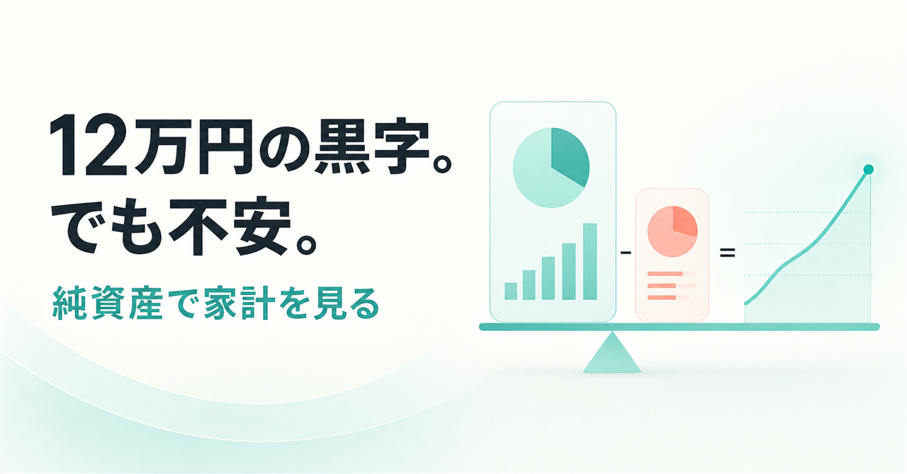
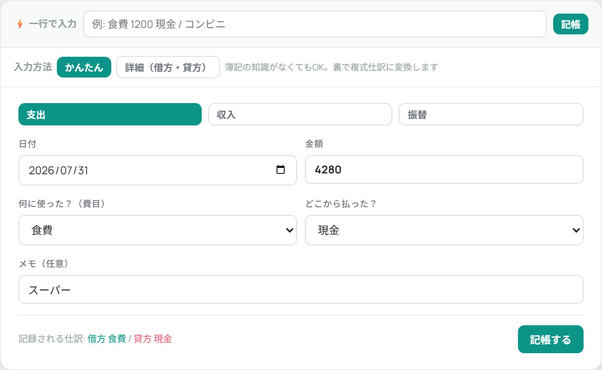
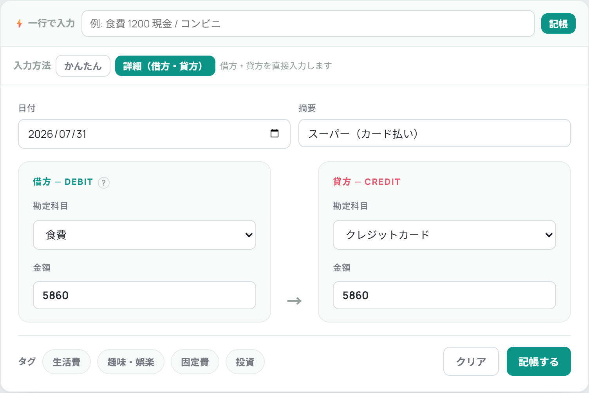
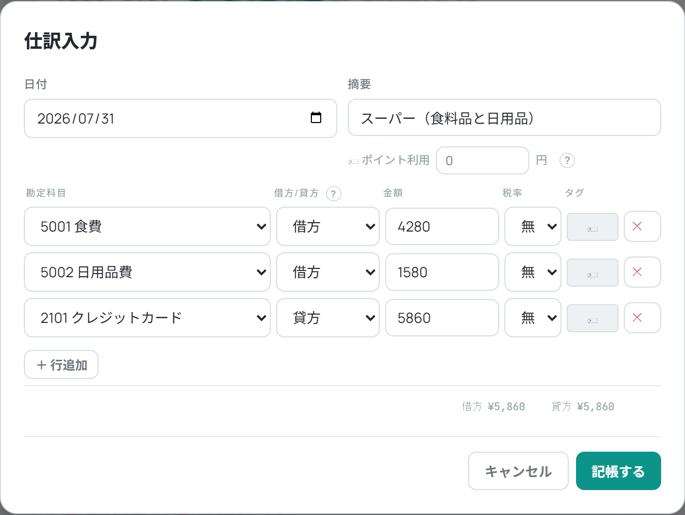
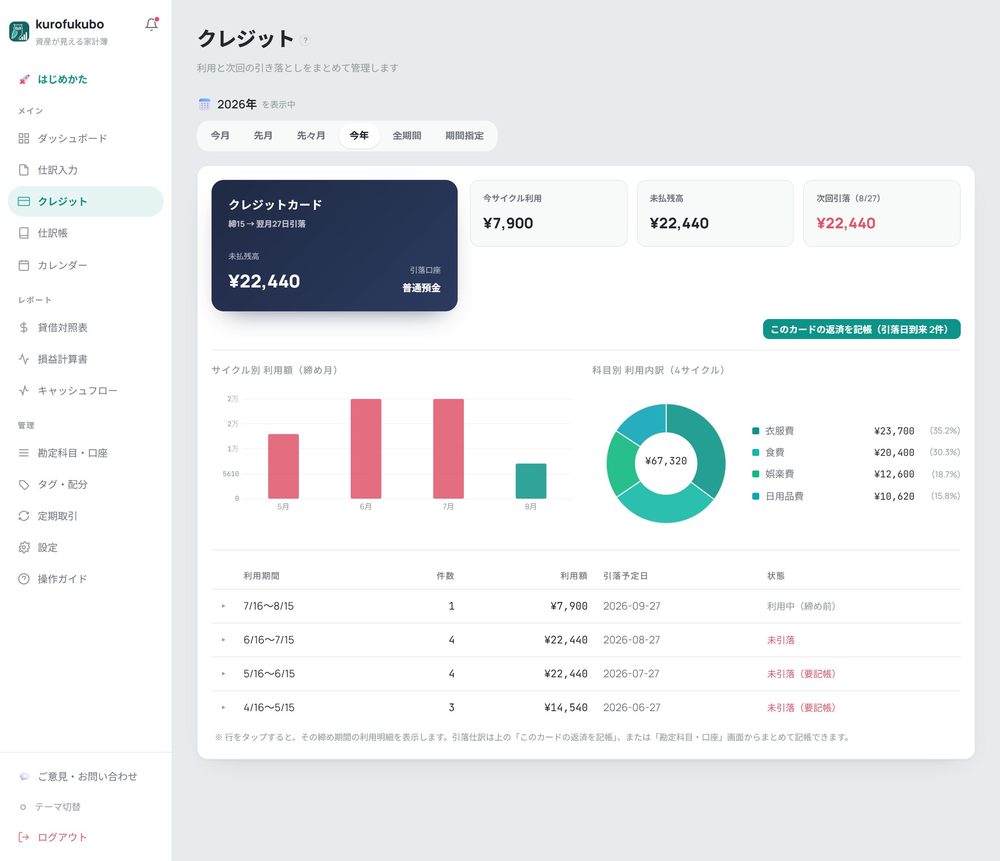
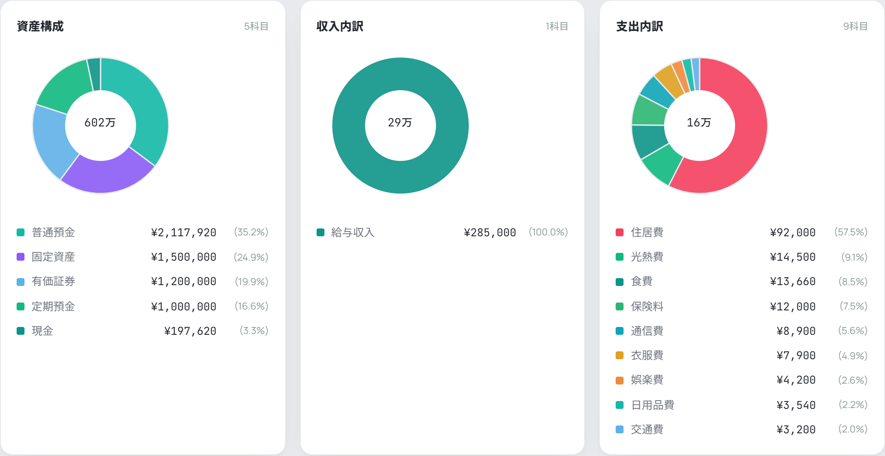
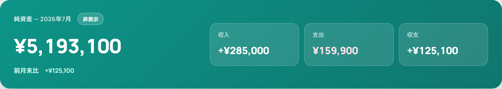

# 12万円の黒字でも安心できない理由。“純資産”で家計を見るとどうなるか

家計簿に架空の家計データを入れてみると、今月は12万5,100円の黒字でした。

それでも、この数字だけでは安心できません。

普通預金はいくら、証券口座はいくら、クレジットカードの未払いはいくら。数字がそれぞれ見えていても、**全部を差し引いた「正味の財産」**が分からないからです。

そこで、私が作っている家計簿「kurofukubo（黒福簿）」にこの架空データを入れ、毎日の入力から月末の確認までを一通り試してみました。

先に結果を書くと、サンプル家計はこうなりました。

- 総資産 6,015,540円
- 負債 822,440円
- **純資産 5,193,100円**
- 今月の収入 285,000円
- 今月の支出 159,900円
- 今月の収支 +125,100円

※この記事の金額・取引は説明用の架空データです。実在する利用者の家計公開ではありません。

*預金や証券などの資産から、借入金やカード未払いなどの負債を引いた「純資産」が最初に見える。*

## まず見たのは「今月いくら使ったか」ではなかった

純資産は、難しい数字ではありません。

> **純資産 = 持っているもの（資産）− 返すもの（負債）**

今回のサンプルでは、現金・普通預金・定期預金・有価証券・固定資産を合わせた総資産が約602万円。カード未払いや借入金などの負債が約82万円。差し引き約519万円が純資産です。

純資産は「今すぐ自由に使える現金」ではありません。預金以外の資産も含めて、家全体の財産と負債のバランスを見るための数字です。証券などの評価額は自動取得されないので、必要に応じて自分で記録を更新します。

この見方をすると、預金だけを見ていたときの勘違いに気づけます。

- 給料日直後に預金が増えても、カード未払いが増えていれば、正味のお金はそれほど増えていない
- ローンを返せば、預金残高が減っても、負債も減る
- 投資を含め、家全体のお金を同じ基準で確認できる

「今月の支出」と「家全体の現在地」は、別の数字として見る。そのために純資産を使います。

## 毎日：入力方法は3つ、取引に合わせて選ぶ

仕訳入力画面には、一行入力・フォーム入力・複数行の仕訳が並んでいます。同じ画面の中で、取引の複雑さに応じて選ぶだけです。

### 1. 一行入力：単純な買い物を速く

たとえばコンビニで1,200円使ったら、画面上部の入力欄に

> 食費 1200 現金 / コンビニ

と入力します。「借方：食費／貸方：現金」の形に変換され、そのまま記帳できます（`/` の後ろは摘要）。科目名は部分一致で拾われ、よく使う組み合わせはキーワードのルールやプリセットとして登録できます。

*一行入力から、仕訳帳への記録、ダッシュボードへの反映まで。※操作の流れを示すための別サンプルです。*

### 2. フォーム入力：普段づかいはこちら

一行の書き方を覚えなくても、フォームから普通に入力できます。「入力方法」で**かんたん**を選ぶと、支出・収入・振替のタブに、日付・金額・費目・支払元・メモを埋めるだけ。借方・貸方という言葉は出てきません。

*かんたんモード。「何に使った？」「どこから払った？」に答える形式で、裏側で複式仕訳に変換される（画面下に生成される仕訳が表示される）。*

簿記の形で入れたいときは**詳細（借方・貸方）**に切り替えます。借方と貸方を左右に置いて、勘定科目と金額を直接指定する画面です。タグもここで付けられます。

*詳細モード。スーパーでの5,860円をカード払いで記録したところ（借方：食費／貸方：クレジットカード）。*

どちらのモードを選んだかは記憶されるので、毎回選び直す必要はありません。

### 3. 複数行の仕訳：内訳を分けたいとき

1件の買い物を複数の費目に分けたいときは、「＋ 新規仕訳」から複数行の仕訳を作ります。

*同じ5,860円の買い物を、食費4,280円と日用品費1,580円に分け、貸方はクレジットカード5,860円。借方合計と貸方合計は画面下で常に照合される。*

行ごとに勘定科目・借方/貸方・金額・税率・タグを指定でき、行はいくつでも追加できます。借方合計と貸方合計が一致しないと記帳できないため、入力ミスがそのまま残りません。

つまり、**単純な買い物は一行入力、普段はフォーム、内訳を分けたいときだけ複数行の仕訳**。この3つで日々の記録は足ります。

入力をまとめたい場合はCSV取込も使えます。黒福簿のCSV形式に加え、マネーフォワードやZaimから出力したCSVを判定して取り込めます。

ただし、銀行やカードとの自動連携はありません。金融機関のIDやパスワードを預けず、手入力かCSVで管理する設計です。

## カードを使った日：「まだ返していないお金」として見る

カードで買い物をした日は、預金がすぐには減りません。だから預金残高だけを見ると、使えるお金が多く見えます。

黒福簿では、クレジットカードを負債として登録できます。締め日・引落日・引落口座を設定すると、利用サイクルごとの金額、未払残高、引落予定日を確認できます。

*カードの利用額、未払残高、締め期間、引落予定を同じ画面で確認。サンプルでは未払残高22,440円、次回引落は8月27日。*

この画面があると、「口座には残っているけれど、すでにカードで使った分」を切り離して考えられます。

引落日が来た未決済分は、返済仕訳を生成できます。カードの利用と銀行口座からの引き落としを二重の支出として数えないのも、複式簿記で記録する利点です。

## 週に一度：予算は「残りいくら」で見る

サンプル家計では、食費・光熱費・通信費・娯楽費などに月の予算を設定しました。

ダッシュボードでは、使った額だけでなく、予算に対する進み具合と残額を確認できます。支出の内訳も円グラフになるため、「今月は住居費以外に何が大きかったか」を探しやすくなります。

*支出の内訳だけでなく、預金・有価証券などの資産構成も同じ画面で確認。*

毎日1円まで合わせることより、週に一度、残り予算と大きな支出を見る。そんな使い方でも、家計の輪郭はつかめます。

## 月の終わりに：純資産が前月より増えたかを見る

月の終わりが近づいたら、もう一度ダッシュボードを開きます。預金、現金、有価証券などが資産。カード未払いや借入金などが負債。その差が純資産です。

*その時点の純資産と前月末比、今月の収入・支出・収支をまとめて確認。*

今回のサンプルでは、この時点で今月の収支は+125,100円、純資産は5,193,100円。前月末比では+125,100円でした。

ここで大切なのは、黒字だったことだけではありません。

**次の月も同じ条件で記録すれば、「純資産が前月より増えたか」を確認できること。**

使いすぎを反省するためではなく、家全体が前に進んでいるかを確かめる。そのための家計簿です。

内訳を詳しく見たいときは、貸借対照表（BS）で資産・負債・純資産を、損益計算書（PL）で期間中の収入と支出を確認できます。キャッシュフロー画面では、現金科目の増減を営業・投資・財務に分けた簡易的な集計も見られます。

## スマホでは、確認と手早い入力を中心に

*スマホ表示のダッシュボード。外出先では現在地の確認や、一行入力・かんたんモードでの記録に使える。*

パソコンでは全体を見渡し、スマホでは日々の入力と確認をする、という使い分けができます。

## この家計簿が向いている人、向いていない人

向いているのは、こんな人です。

- 預金だけでなく、投資やローン、カード未払いを含めて把握したい
- 毎月の節約額より、純資産が増えているかを見たい
- 銀行のログイン情報を家計簿サービスに預けたくない
- 一行入力・フォーム入力・CSVを使い分けて記録し、BS・PL・CFまで確認したい

一方で、銀行やカードの明細を自動取得し、何もしなくても家計簿が完成してほしい人には向きません。黒福簿には金融機関との自動連携も、レシートOCRもありません。

また「家族のお金を一つの帳簿で見る」ことはできますが、現時点では家族それぞれのアカウントで共同編集する機能はありません。

## まず3分、登録なしで試せます

黒福簿は、メール登録をせずにゲストモードで試せます。ゲストの家計データはブラウザの端末内に保存され、APIには送信されません。ブラウザのデータを消すと失われる点には注意してください。

開いたら、次のどちらか一つだけ試してみてください。

1. 初回ガイドの「サンプルで見る」を押し、数か月分の例で純資産の変化を見る
2. 「食費 1200 現金」と一行だけ、またはかんたんモードのフォームから一件だけ入れ、ダッシュボードの数字がどう変わるか見る

▶ **[登録なしで黒福簿を試す](https://app.kurofukubo.com/?guest&utm_source=note&utm_medium=article&utm_campaign=networth_case)**

無料登録後は、ゲストで入力したデータを引き継げます。設定からE2E暗号化を有効にすると、家計データは端末側で暗号化され、サーバーには暗号文だけが保存されます。パスフレーズを忘れたときに備え、有効化時に表示されるリカバリキーを保存しておいてください（その場で保存しなかった場合も、設定画面から再発行できます）。

まだ無料ベータとして改善中です。「ここで迷った」「この説明が分かりにくい」といった感想があれば、コメントで教えてもらえるとうれしいです。

