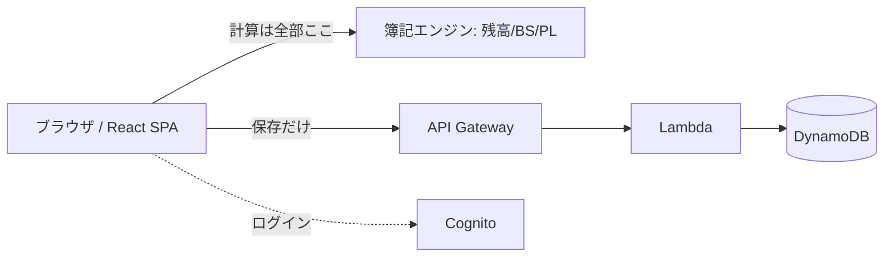

複式簿記ベースの家計管理Webアプリ **黒福簿（kurofukubo）** を作りました。
収支を足し算するだけの家計簿に挫折し続けた自分が、「今いくら持っていて、いくら借りてるのか」を正確に知りたくて作ったやつです。
登録なしで試せます 👉 https://kurofukubo.com

## まとめ（先に全部書いておく）

- **何**：複式簿記で記帳すると、BS（貸借対照表）/ PL（損益計算書）が自動で出る家計簿
- **技術**：React + Vite / AWSサーバーレス（Lambda + DynamoDB + Cognito）
- **推し**：登録不要のゲストモード、クイック入力、CSV取込、CSV/PDF出力
- **苦労**：CSVの文字化け、PDFの日本語フォント、二重記帳バグ
- この記事は宣伝というより「作って詰まったところ」の共有です

:::message
この記事で書くこと：作ったものの紹介と、技術的に詰まった点。
書かないこと：簿記そのものの入門（借方・貸方の説明）は最小限です。
:::

## 作ったもの

こんな感じのやつです。

<!-- screenshot: ダッシュボード（純資産・今月の収支・予算バー）の様子 / 01-dashboard.png -->

記帳はクイック入力が一番速くて、1行打つだけで複式仕訳に変換されます。

```text
食費 1200 現金
   ↓ 自動変換
借方: 食費   1,200
貸方: 現金   1,200
```

<!-- screenshot: 仕訳入力画面（クイック入力欄・プリセットのチップ）の様子 / 02-journal.png -->

プリセットのチップを押すと、内容が事前入力された状態で仕訳モーダルが開きます。

<!-- screenshot: プリセットから事前入力された仕訳モーダルの様子 / 02b-journal-modal.png -->

記帳すると、貸借対照表と損益計算書がリアルタイムで出ます。ここが普通の家計簿アプリとの一番の違いで、**「資産・負債・純資産」というストックが見える**。クレカの未払金も負債としてちゃんと乗るので、「使った日」と「引き落とし日」のズレで残高が分からなくなる、あの現象が消えます。

<!-- screenshot: 貸借対照表(BS)の様子 / 04-bs.png -->
<!-- screenshot: 損益計算書(PL)の様子 / 05-pl.png -->

銀行明細のCSV取込、CSV/PDFエクスポートもあります。

## なぜ作ったか

家計簿アプリ、たぶん5回くらい挫折してます。マネーフォワード、Zaim、Excel、最後は [beancount](https://beancount.github.io/)。

beancountは思想が完璧でした。複式簿記でテキスト管理、エンジニアならこれだろ、と。でも1ヶ月で投げました。スマホでテキスト編集がつらい、CSV整形が面倒、「コンビニで500円」を記録するのにエディタを開く気力が出ない。

正しさは分かる。でも続かない。**続けられない正しさは自分には無価値**で、だったら「複式簿記の正しさ」と「家計簿アプリの手軽さ」を両取りするWebアプリを作るか、という雑な動機で始まりました。

## 技術スタック

| レイヤ | 採用 | ひとこと |
| --- | --- | --- |
| フロント | React 18 + Vite | 入力UXが命なのでSPA |
| API | API Gateway + Lambda (Node20/arm64) | 来た分だけ課金されたい |
| DB | DynamoDB（シングルテーブル） | 個人開発、月数十円で済む |
| 認証 | Cognito (SRP + Google OAuth) | 自前認証は怖い |
| 配信 | CloudFront + プライベートS3 (OAC) | S3直公開はしない |
| IaC | AWS SAM | コマンド一発で戻せる安心感 |



方針として、**簿記の計算は全部ブラウザでやって、APIは保存だけ**にしました。入力中の検算（借方=貸方）がサーバー往復なしで効くし、後述のゲストモードがAPIなしで成立します。

## 工夫したところ

### 複式簿記エンジンは意外と短い

心臓部はびっくりするほど短くて、勘定科目の種別で「残高がプラスになる向き」が反転する、これだけです。

```js
// 資産・費用は借方残高(dr−cr)、負債・純資産・収益は貸方残高(cr−dr)
const BALANCE_SIGN = {
  asset: 1, expense: 1,
  liability: -1, equity: -1, income: -1,
};

function accountBalance(account, lines) {
  const sign = BALANCE_SIGN[account.type];
  return lines
    .filter((l) => l.accountId === account.id)
    .reduce((bal, l) => bal + sign * (l.side === 'dr' ? l.amount : -l.amount), 0);
}
```

これだけでBSもPLも残高一覧も全部支えてます。会計の整合性が一箇所に閉じてるので、帳票を増やしても破綻しないのが気持ちいい。

### ゲストモードは「APIを一切呼ばない」

一番こだわった機能です。「ゲストとして試す」を押すと、サインアップなしで全機能を触れます。データは `localStorage` だけ、APIは1回も呼ばれません。

登録するとゲスト中のデータがそのまま引き継がれます。

```js
// ゲスト(localStorage) → ログイン後にまとめてサーバーへ
const guest = JSON.parse(localStorage.getItem('kk4_guest') ?? '{}');
if (guest.journals?.length) {
  await bulkImport(guest);          // DynamoDBへ一括投入
  localStorage.removeItem('kk4_guest');
}
```

「まず触ってダメなら閉じる」を許したかった。家計簿って登録した時点で半分満足して使わなくなるので。

## 苦労したところ（だいたいここで時間が溶けた）

### CSVがExcelで文字化けして頭を抱えた

家計データの出力先って結局Excelなんですよね。UTF-8をそのまま吐いたら盛大に文字化けして、「これじゃ誰も使わん」となりました。原因はBOMなし。**先頭にBOM（``）を1文字足すだけ**で直った。

```js
const BOM = ''; // ← Excelの文字化け対策はこの1文字
const blob = new Blob([BOM + csvText], { type: 'text/csv;charset=utf-8' });
```

値のエスケープもRFC 4180準拠で自前実装。ここを雑にやると「金額の途中で列がズレる」最悪のバグになります。

### PDFの日本語フォントで一回心が折れた

最初、jsPDFに日本語テキストを埋め込もうとして、フォントのサブセット化でバンドルが激重になって挫折しました。

:::details で、どう割り切ったか
家計のPDFって「見た目そのまま保存・印刷できればOK」で、PDF内テキスト検索なんて誰もしない。なので `html2canvas` で画面を画像化して `jsPDF` でA4に貼る方式にしました。文字選択はできないけど、フォント同梱を捨ててバンドルも実装コストも激減。`jspdf` / `html2canvas` は動的importにして、エクスポートを使う人だけがその chunk を読みます。
:::

### 「記帳する」連打で二重記帳された

テスト中に勢いよく連打したら同じ仕訳が2件入りました。お金を扱うアプリでこれは普通にアウト。定番の保存中ガードで握りつぶしてます。

```jsx
const [saving, setSaving] = useState(false);

const handleSave = async () => {
  if (saving) return;          // 連打ガード
  setSaving(true);
  try {
    await addJournal(/* ... */);
  } finally {
    setSaving(false);
  }
};
```

派手さゼロ。でもこの「お金がズレない」ための地味な詰めの総和が、家計アプリの信頼性そのものだと思ってます。

## 使ってみて

自分は今のところ毎日続いてます（過去最高記録）。クレカの未払金が負債として見えるようになって、引き落とし日にビビらなくなったのが一番でかい。

一方で、複式簿記のとっつきにくさは課題のまま。クイック入力やプリセットで「簿記を意識せず記帳できる」導線をどこまで作れるかが、たぶん勝負どころです。

## これから

- **AI仕分け**：摘要から勘定科目を提案する機能を準備中。ただし家計データを外部に投げる以上、**明示的な同意なしには使えない**オプトイン設計を前提にしてます。
- 家族共有、明細の自動連携も検討中。

OSSではないですが、複式簿記で家計を回したい人のリアルな声が一番欲しいです。触って「ここ分かりにくい」を投げつけてくれると泣いて喜びます。

🔗 **黒福簿（kurofukubo）**: https://kurofukubo.com
