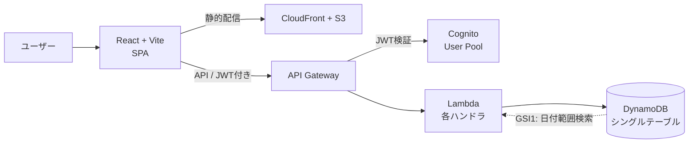
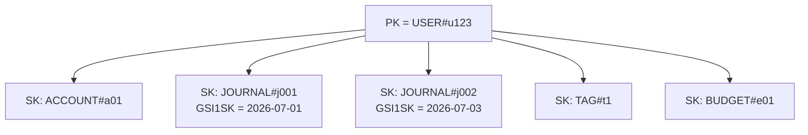
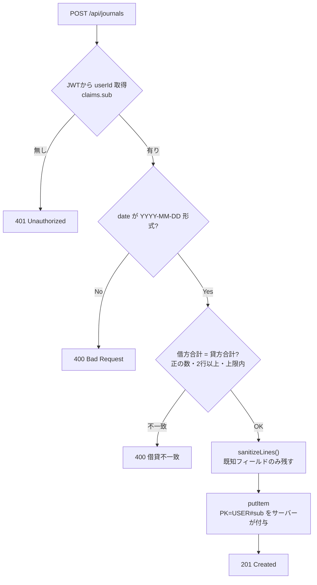
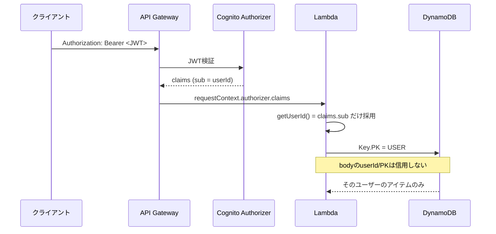

## はじめに

個人開発で「複式簿記ベースの家計簿」をSaaS化しています。もともとは1枚の `kakeibo.html`（localStorage、約980行）で動くローカルアプリでしたが、これを **React + Vite（フロント）／ AWS SAM（Lambda + DynamoDB + Cognito）** に載せ替えました。

家計簿というと単純に見えますが、複式簿記にすると設計上おもしろい制約が出てきます。

- **借方の合計 = 貸方の合計** という不変条件（これが崩れたデータは1件でも入れてはいけない）
- ユーザーごとに勘定科目・仕訳・タグ・予算…と**種類の違うデータが大量にぶら下がる**
- 家計データという**センシティブな情報**なので、テナント（ユーザー）分離を絶対に破ってはいけない

この記事では、上記をどう設計・実装したかを、実際のコードを引用しながら整理します。テーマは3つです。

1. DynamoDB シングルテーブル設計（＋なぜRDBでなくDynamoか）
2. 借方・貸方の一致検証（会計の不変条件をサーバーで守る）
3. テナント分離と「クライアントを信用しない」入力検証

## 全体アーキテクチャ

まず全体像です。フロントは静的配信、APIは Cognito で認証、データは DynamoDB という素直なサーバーレス構成です。



ポイントは、**認証（Cognito）→ API Gateway が JWT を検証 → Lambda には検証済みの状態で届く**という流れです。この「Lambdaに届く時点で本人確認は済んでいる」前提が、後半のテナント分離の土台になります。

## なぜ RDB でなく DynamoDB を選んだか

一番よく聞かれる判断です。会計データなら普通はRDBを思い浮かべます。それでもDynamoDBにしたのは、**個人開発のコスト構造**と**アクセスパターンの単純さ**が噛み合ったからです。

| 観点 | RDS（RDB） | DynamoDB |
|---|---|---|
| スケール | 垂直中心 | 水平・自動 |
| 運用 | パッチ・バックアップ・監視あり | フルマネージド |
| 課金 | 起動時間課金（アイドルでも発生） | オンデマンド（使った分だけ） |
| 個人開発の相性 | ユーザー0でも費用がかかる | **アイドル時ほぼ0円** |
| 得意なこと | 柔軟なJOIN・集計 | **決まったアクセスパターンを高速・低コスト** |

決め手は2つ。

1. **使われない時間がほぼ0円**。個人開発で一番怖いのは「ユーザーが少ないのに固定費が出続ける」ことです。DynamoDBのオンデマンドなら、寝ている間のコストはほぼゼロ。
2. **アクセスパターンが単純**。家計簿の読み取りは実質「**あるユーザーの◯◯を全部**」と「**あるユーザーの仕訳を期間で**」の2つに集約できます。自由なJOINや横断集計は必須ではありません（集計は期間取得後にアプリ側で計算）。

DynamoDBは「先にアクセスパターンを決め、そこから逆算してキーを設計する」DBです。上の2パターンがはっきりしていたので、むしろ相性が良かった、というのが実感です。

:::message
**正直な弱み**：DynamoDBは横断的な分析・集計が苦手です。「全ユーザーの費目別平均」のような分析クエリは向きません。今回はユーザー単位の家計簿なのでほぼ問題になりませんが、将来ダッシュボード分析が欲しくなったら、エクスポート＋Athena等に逃がす想定です。ここは割り切りです。
:::

## 1. DynamoDB シングルテーブル設計

### なぜ「シングル」テーブルか

種別（勘定科目・仕訳・タグ・口座・予算・定期取引…）ごとにテーブルを分ける手もあります。それでも**1テーブルに全部入れる**シングルテーブル設計にしたのは、判断基準がきれいに片側へ寄ったからです。

- ✅ **同時に触るデータを1つの単位にまとめられる**：あるユーザーのデータは、まとめて共通のPK（`USER#<id>`）にぶら下がる
- ✅ **運用が一元化**：テーブルが1つなら、キャパシティ・バックアップ・監視も1箇所
- ❌ マルチテーブルが要る条件（別々のStreamsを複数、分析用途、テーブル間結合が前提）に**当てはまらない**

イメージとしては、1人のユーザーのPKに、種別の違うSKがぶら下がる形です。



### キー設計

| 用途 | PK | SK | GSI1SK |
|---|---|---|---|
| 仕訳 | `USER#<userId>` | `JOURNAL#<id>` | `date`（YYYY-MM-DD） |
| 勘定科目 | `USER#<userId>` | `ACCOUNT#<id>` | — |
| タグ | `USER#<userId>` | `TAG#<id>` | — |

- **PK は常にユーザー**。これが後述するテナント分離の土台。
- **SK は「種別#id」の前方一致**で引く。`begins_with(SK, "JOURNAL#")` でそのユーザーの全仕訳が取れる。
- **仕訳の期間検索**だけは頻度が高いので、GSI1（PK同じ・ソートキー=日付）を張って `BETWEEN` で範囲取得。日付のような範囲検索対象は**ソートキーに置く**のが定石です。

このテーブルは AWS SAM（CloudFormation）で次のように定義しています。抜粋ですが、キー設計がそのままインフラのコードになっているのが分かります。

```yaml
# template.yaml
KakeiboTable:
  Type: AWS::DynamoDB::Table
  Properties:
    TableName: !Sub kakeibo-${Stage}
    BillingMode: PAY_PER_REQUEST          # オンデマンド課金＝アイドル時ほぼ0円
    AttributeDefinitions:
      - AttributeName: PK                 # USER#<userId>
        AttributeType: S
      - AttributeName: SK                 # JOURNAL#<id> / ACCOUNT#<id> ...
        AttributeType: S
      - AttributeName: GSI1SK             # 仕訳の日付 YYYY-MM-DD
        AttributeType: S
    KeySchema:
      - AttributeName: PK
        KeyType: HASH
      - AttributeName: SK
        KeyType: RANGE
    GlobalSecondaryIndexes:
      - IndexName: GSI1
        KeySchema:
          - AttributeName: PK
            KeyType: HASH
          - AttributeName: GSI1SK         # 日付で BETWEEN 範囲検索
            KeyType: RANGE
        Projection:
          ProjectionType: ALL
    PointInTimeRecoverySpecification:
      PointInTimeRecoveryEnabled: true    # 継続バックアップ（誤操作・障害対策）
```

小ネタですが、**`GSI1SK` を持つのは仕訳だけ**です（保存時に日付を渡した仕訳にしか付かない）。結果としてGSI1は**スパースインデックス**になり、科目やタグは載りません。GSI1へのクエリは自然と「仕訳の期間検索」専用になります。

アクセスは薄いヘルパー（`lib/db.js`）に集約しました。ポイントは、**PK をアプリ層のどこからも直接組み立てさせず、必ず `userPK(userId)` を通す**ことです。

```js
export const userPK = (userId) => `USER#${userId}`;

/** SK前方一致でクエリ (例: JOURNAL#) */
export async function queryByPrefix(userId, skPrefix, opts = {}) {
  const params = {
    TableName: TABLE,
    KeyConditionExpression: 'PK = :pk AND begins_with(SK, :prefix)',
    ExpressionAttributeValues: { ':pk': userPK(userId), ':prefix': skPrefix },
  };
  // ...LastEvaluatedKey を見てページネーションして全件返す
}

/** GSI1で日付範囲クエリ (仕訳の期間検索) */
export async function queryByDateRange(userId, start, end) {
  const params = {
    TableName: TABLE,
    IndexName: 'GSI1',
    KeyConditionExpression: 'PK = :pk AND GSI1SK BETWEEN :s AND :e',
    ExpressionAttributeValues: { ':pk': userPK(userId), ':s': start, ':e': end },
  };
  // ...
}
```

DynamoDBは1回のQueryで最大1MB／件数上限があるので、ヘルパー側で `LastEvaluatedKey` を見て**ページネーションを回し切る**ようにしています。呼び出し側はページングを意識しなくて済みます。

## 2. 借方・貸方の一致検証 — 会計の不変条件をサーバーで守る

複式簿記の心臓は **「借方合計 = 貸方合計」**。ここが崩れると帳簿全体が壊れます。フロントでもチェックしますが、**最後の砦はサーバー**です。仕訳の作成は、必ず次のフローを通ります。



検証本体（`handlers/journals.js`）はこうです。

```js
const MAX_LINES = 100;

/** 仕訳行の妥当性検証。問題なければ null、あればエラーメッセージを返す */
function validateLines(lines) {
  if (!Array.isArray(lines) || lines.length < 2) return 'lines は2行以上必要です';
  if (lines.length > MAX_LINES) return `lines は${MAX_LINES}行以内です`;
  for (const l of lines) {
    if (!l || !l.accountId) return '各行に accountId が必要です';
    if (l.side !== 'dr' && l.side !== 'cr') return 'side は dr または cr です';
    if (typeof l.amount !== 'number' || !isFinite(l.amount) || l.amount <= 0)
      return '金額は正の数値が必要です';
  }
  const dr = lines.filter((l) => l.side === 'dr').reduce((s, l) => s + l.amount, 0);
  const cr = lines.filter((l) => l.side === 'cr').reduce((s, l) => s + l.amount, 0);
  if (Math.abs(dr - cr) > 0.01) return `借方(${dr})と貸方(${cr})が一致しません`;
  return null;
}
```

ここでのポイント：

- **2行以上・行数上限**：複式なので最低でも借方1・貸方1。上限を設けて巨大ペイロードを弾く。
- **金額は正の数だけ**：マイナス金額で符号を反転させる小細工を許さない（増減は `side` で表現する）。
- **一致は誤差込みで判定**：`Math.abs(dr - cr) > 0.01`。浮動小数の丸め誤差を考慮。

さらに、保存前に**既知フィールドだけ残す**ホワイトリスト方式でサニタイズします。クライアントが余計なフィールドを紛れ込ませても保存されません。

```js
function sanitizeLines(lines) {
  return lines.map((l) => ({
    accountId: l.accountId,
    side: l.side,
    amount: l.amount,
    taxRate: typeof l.taxRate === 'number' && isFinite(l.taxRate) ? l.taxRate : 0,
    // splits（タグ按分）も件数上限つきでホワイトリスト
  }));
}
```

POSTハンドラは「検証 → サニタイズ → 保存」の順で、**検証を通らなければ1件もDBに触れない**構造です。

### なぜ `TransactWriteItems` を使わなかったか

DynamoDBで複式簿記のような「複数行がセットで正しくないといけないデータ」を作る、というと、定石として真っ先に挙がるのが `TransactWriteItems` です。借方行・貸方行をそれぞれ別アイテムとして書き、トランザクションで原子的にコミットする設計です（[AWS公式：複数アイテムに調整された変更を加える](https://aws.amazon.com/jp/blogs/news/making-coordinated-changes-to-multiple-items-with-amazon-dynamodb-transactions/)、[Hacker Newsで紹介されている実例](https://news.ycombinator.com/item?id=24433902)では1取引=4アイテムをトランザクションで書いています）。

今回はこれを**採用しませんでした**。理由は単純で、**仕訳をそもそも複数アイテムに分割していない**からです。1仕訳＝1アイテムに `lines` 配列をまるごと埋め込んでいるので、書き込みは最初から `PutItem` 1回で完結します。DynamoDBの単一アイテム書き込みはもともとアトミックなので、複数アイテムを守るための `TransactWriteItems`自体が要りません。

```js
// 検証（validateLines）を通った後は、ただの PutItem 1回
const item = await putItem(userId, SK(newId), {
  id: newId,
  date: body.date,
  desc: body.desc || '',
  lines: sanitizeLines(body.lines), // 借方・貸方の全行がここに1つの配列で入る
  createdAt: new Date().toISOString(),
}, body.date);
```

貸借一致の担保は「複数アイテムを同時に書く」問題ではなく「1個のアイテムを書く**前**に検証する」問題に置き換わっています。書き込みが原子的であることをDynamoDB自身に保証させ、正しさの担保はアプリ層（`validateLines`）に寄せた形です。

これにはトレードオフもあります。

| | 行ごとに別アイテム＋Transaction | 1仕訳=1アイテムに集約（採用） |
|---|---|---|
| 貸借一致の担保 | DBのトランザクションで保証 | 書き込み前のアプリ検証で保証 |
| 書き込みコスト | 準備＋コミットの2回読み書き（約2倍） | 通常のPutItem 1回分 |
| 仕訳単位でのGet | 複数アイテムをまたいで再構成が必要 | `GetItem` 1回でlines全部取れる |
| 1仕訳の行数上限 | 実質DynamoDBのトランザクション上限（100アイテム）まで拡張しやすい | 1アイテム400KBの範囲内（`MAX_LINES=100`で運用上十分に収まる想定） |

DynamoDBのトランザクションは「準備→コミット」で通常の書き込みの約2倍のRCU/WCUを消費するとされています（[AWS公式ドキュメント](https://docs.aws.amazon.com/amazondynamodb/latest/developerguide/transaction-apis.html)）。個人開発のような低トラフィックの運用では大差ではありませんが、**「複数アイテムをトランザクションで守る」より前に「そもそも1アイテムに収めてトランザクション自体を不要にできないか」を検討する価値がある**、というのがこの部分の要点です。家計簿の仕訳は行数に上限があり、1アイテムに収めても実用上困らない規模だったので、この設計に倒しました。

## 3. テナント分離と「クライアントを信用しない」

家計データなので、**他人のデータが1バイトも混ざらない**ことが最優先です。設計を2段構えにしました。

### (a) userId は必ず検証済みJWTから取る

ユーザーIDは、リクエストボディやクエリからは**絶対に受け取りません**。API Gatewayが検証済みのJWTの `sub` からのみ取得します。

```js
// ❌ やってはいけない：クライアントの申告を信じる
// const userId = body.userId;

// ✅ 正解：API Gatewayが検証済みのJWTクレームから取る
export function getUserId(event) {
  const claims = event.requestContext?.authorizer?.claims;
  if (!claims?.sub) return null;
  return claims.sub;
}
```

各ハンドラの冒頭はこう始まります。ここで得た `userId` が、DBアクセスの `PK` を決める唯一の源です。

```js
const userId = getUserId(event);
if (!userId) return unauthorized();
```

この「Lambdaに届く時点でJWTは検証済み」という前提は、SAM側で**宣言的に**効かせています。API全体に `DefaultAuthorizer` を1つ指定するだけで、全ルートがJWT必須になります（プリフライトの `OPTIONS` だけ後述の通り例外）。

```yaml
# template.yaml
Globals:
  Function:
    Runtime: nodejs24.x
    Environment:
      Variables:
        TABLE_NAME: !Ref KakeiboTable       # db.js の process.env.TABLE_NAME に入る
        ALLOWED_ORIGIN: !Ref AllowedOrigin  # CORS 許可オリジン

KakeiboApi:
  Type: AWS::Serverless::Api
  Properties:
    StageName: !Ref Stage
    Auth:
      DefaultAuthorizer: CognitoAuth        # ← 全ルート既定でJWT検証
      Authorizers:
        CognitoAuth:
          UserPoolArn: !GetAtt UserPool.Arn
    MethodSettings:                          # ステージ全体のスロットリング（DoS・コスト暴走対策）
      - ResourcePath: "/*"
        HttpMethod: "*"
        ThrottlingRateLimit: 25
        ThrottlingBurstLimit: 50
```

関数側では、ルートを貼りつつ **プリフライトの `OPTIONS` だけ認証を外し**、権限も**このテーブルにだけ**絞ります（最小権限）。

```yaml
JournalsFunction:
  Type: AWS::Serverless::Function
  Properties:
    Handler: src/handlers/journals.handler
    Events:
      Create:
        Type: Api
        Properties: { RestApiId: !Ref KakeiboApi, Path: /api/journals, Method: POST }
      # GET / PUT /api/journals/{id} / DELETE も同様（既定でJWT必須）
      Options:                               # プリフライトだけ認証を外す
        Type: Api
        Properties:
          RestApiId: !Ref KakeiboApi
          Path: /api/journals
          Method: OPTIONS
          Auth: { Authorizer: NONE }
    Policies:
      - DynamoDBCrudPolicy:                  # このテーブルにだけ権限を付与（最小権限）
          TableName: !Ref KakeiboTable
```

流れを図にするとこうなります。**bodyのuserIdやPKは一切見ない**のがミソです。



### (b) キーはサーバーが権威的に上書きする

たとえクライアントがJSONに `PK` や `SK` を含めてきても、**信用せず捨てて**サーバー側で `userPK(userId)` を貼り直します。これで「他人のPKを詐称して書き込む」経路を塞ぎます。

```js
export async function putItem(userId, sk, data, gsi1sk) {
  // クライアント由来のキー(PK/SK/GSI1SK)は信頼しない。サーバー側で権威的に上書きする
  const { PK, SK, GSI1SK, ...safe } = data || {};
  const item = { ...safe, PK: userPK(userId), SK: sk, updatedAt: new Date().toISOString() };
  if (gsi1sk) item.GSI1SK = gsi1sk;
  await ddb.send(new PutCommand({ TableName: TABLE, Item: item }));
  return item;
}
```

読み取り・削除も同様に、**キーは常に `userPK(userId)` 経由**。ハンドラが `userId` を取り違えない限り、あるユーザーが別ユーザーのアイテムに触れる経路が存在しません。

### (c) その他の defense-in-depth

- **CORSオリジン制限**：`ALLOWED_ORIGIN` 環境変数で許可オリジンを絞る（未設定時のみ `*`）。
- **入力長制限**：摘要200文字などの上限を全フィールドに。
- **日付は正規表現で厳格化**：`/^\d{4}-\d{2}-\d{2}$/` 以外は弾く。GSI1SKに素性の悪い値を入れさせない。

## 設計のふりかえり

- **DynamoDBは「アクセスパターンが単純 × アイドル時0円」の個人開発と好相性**。会計データ＝即RDB、と決めつけず、読み取りの形から逆算して選ぶと納得感がある。
- **シングルテーブル + 「PKは常にユーザー」** が、テナント分離とアクセスパターンの両方をきれいに解決してくれた。キー生成を1関数に閉じ込めたのが効いています。
- **会計の不変条件（借貸一致）はサーバーで守る**。フロントの検証はUXのためで、正しさの保証はAPI層に置く。
- **「クライアントが送ってきたキー・余分フィールドは一切信用しない」** を徹底すると、テナント越境と汚染データの両方を同じ方針で防げる。
- **「複数アイテム+Transaction」より先に「1アイテムに収まらないか」を疑う**。今回は仕訳という単位がちょうど1アイテムに収まる粒度だったので、トランザクションの複雑さとコストを丸ごと避けられた。

:::message
**正直な振り返り**：シングルテーブル設計を提唱した張本人であるRick Houlihan氏は[2024年に自らの発言を軌道修正](https://x.com/houlihan_rick/status/1760469859761029228)し、「GSIが25個まで使え、オンデマンド課金になった今、単一テーブルに無理に詰め込む必要性の多くは薄れた」という趣旨のことを述べています（[DeBrie氏の解説](https://www.alexdebrie.com/posts/dynamodb-single-table/)も同様の文脈でよく引用されます）。今回のkurofukuboの規模（個人開発・数ユーザー）であれば、種別ごとにテーブルを分けても実務上の不都合はおそらくほぼありません。それでもシングルテーブルにしたのは「PKは常にユーザー」という設計原則がテナント分離とアクセスパターンの両方にきれいにハマったからで、**「流行りだから」ではなく「この制約に合っていたから」**という理由付けは自分の中で持っておきたいところです。
:::

家計簿は身近な題材ですが、「壊れてはいけないデータをどう守るか」を考える良い練習台でした。次はこの上に、確定申告用の集計や資産推移グラフを載せていく予定です。

（この記事のコードは実プロダクトのバックエンドから引用しています。テーブル名・プールIDなどの固有値は伏せています。）

## 参考

- [DynamoDB、シングルテーブルかマルチテーブルか](https://zenn.dev/papanyanko/articles/dynamodb-single-or-multi-table)
- [RDBMS脳から卒業する！DynamoDB実践設計ガイド](https://zenn.dev/koracloud/articles/4a444e0ca0c27e)
- [DynamoDB 1億ユーザー × 1,000アイテムの設計戦略を作ってみる](https://zenn.dev/zenn_tkc/articles/cfe803d3960b0a)
- [Amazon DynamoDB Transactions を使用して複数のアイテムに調整された変更を加える（AWS公式・日本語）](https://aws.amazon.com/jp/blogs/news/making-coordinated-changes-to-multiple-items-with-amazon-dynamodb-transactions/)
- [Amazon DynamoDB Transactions: How it works（AWS公式ドキュメント）](https://docs.aws.amazon.com/amazondynamodb/latest/developerguide/transaction-apis.html)
- [DynamoDBで複式簿記を実装した例の議論（Hacker News）](https://news.ycombinator.com/item?id=24433902)
- [The What, Why, and When of Single-Table Design with DynamoDB（Alex DeBrie）](https://www.alexdebrie.com/posts/dynamodb-single-table/)
- [Rick Houlihan氏によるシングルテーブル設計への軌道修正発言（X）](https://x.com/houlihan_rick/status/1760469859761029228)
