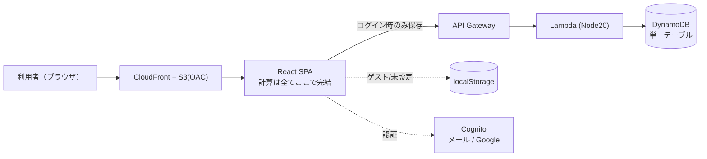
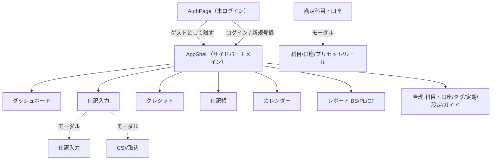
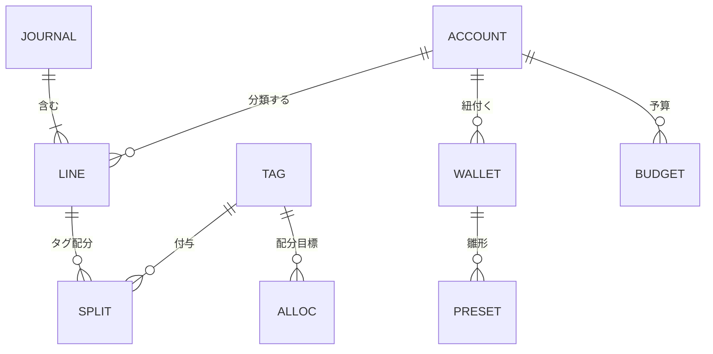
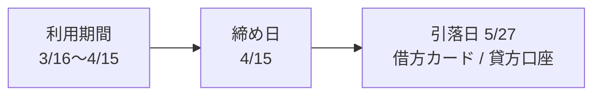

# 黒福簿（kurofukubo） 基本設計書

| 項目 | 内容 |
|---|---|
| システム名 | 黒福簿（kurofukubo）— 複式簿記の家計簿 SaaS |
| 文書種別 | 基本設計書（外部設計） |
| 版 | 1.0（2026-06-14 時点・本番反映済み） |
| 関連文書 | `SPEC.md`（現行仕様サマリ）／`詳細設計書.md`（内部設計）／`NEXT_STEPS.md`（インフラ環境メモ・作業履歴） |

---

## 1. はじめに

### 1.1 目的
本書は黒福簿の外部設計（利用者視点での機能・画面・データ・非機能要件）を定義する。実装詳細は `詳細設計書.md` に分離する。

### 1.2 対象読者
プロダクト関係者・開発者・レビュア。

### 1.3 用語
| 用語 | 説明 |
|---|---|
| 複式簿記 | 1取引を借方・貸方の2面で記録する記帳方式。貸借が必ず一致する。 |
| 借方/貸方 | 仕訳の左側/右側。資産・費用は借方で増、負債・純資産・収益は貸方で増。 |
| 仕訳 | 1取引の記録。日付・摘要・複数の明細行（借方/貸方）からなる。 |
| 勘定科目 | 取引の分類（現金・食費・クレジットカード等）。資産/負債/純資産/収益/費用の5区分。 |
| BS/PL/CF | 貸借対照表/損益計算書/キャッシュフロー計算書。 |
| ゲストモード | 登録せずに端末内（localStorage）だけで利用する状態。 |
| 締め/引落 | クレカの利用集計の締め日と、口座から引き落とされる日。 |

---

## 2. システム概要

### 2.1 背景・目的
一般的な家計簿アプリは単式（収支の足し算）で、資産・負債・純資産（ストック）やクレカの利用/引落の時間差を表現できない。本システムは**複式簿記の正確さ**と**家計簿アプリの手軽さ**の両立を目的とする。

### 2.2 特徴
- 仕訳から BS/PL/CF を自動導出。純資産が一目で分かる。
- クレジットカードの「締め→引落」サイクルを画面・自動起票で一貫管理。
- 登録不要のゲストモードで即試用、登録時にクラウドへ移行。
- クイック入力・プリセット・CSV取込・自動分類で記帳負荷を軽減。

### 2.3 利用者と権限
| 区分 | 説明 | 制限 |
|---|---|---|
| ゲスト | 未登録。端末内のみ。 | タグ/口座/追加科目 各5件まで。広告多め。 |
| Free | 登録済み（現状すべてのログインユーザー）。 | 広告あり（頻度低）。 |
| Pro / Family | 課金ティア（**未実装**）。 | 広告なし（予定）。 |

### 2.4 システム構成（論理）

### 2.5 対応環境
- モダンブラウザ（PC/スマホ）。レスポンシブ対応。ライト/ダークテーマ。

---

## 3. 機能要件一覧

| No | 機能 | 概要 |
|---|---|---|
| F-01 | 認証 | メール（Cognito）/ Google ログイン / パスワード再設定 / ゲスト / アカウント削除 |
| F-02 | ゲスト移行 | 登録時にゲストデータをクラウドへ一括移行 |
| F-03 | ダッシュボード | KPI・円グラフ・予算・月次推移・初回セットアップ |
| F-04 | 仕訳入力 | 新規/編集/削除、クイック入力、プリセット適用、検索・ソート、一括選択/削除/編集、ポイント利用 |
| F-05 | クレジット | カード別の締め→引落サイクル表示・グラフ・利用明細 |
| F-06 | 仕訳帳 | 期間別の元帳・エクスポート |
| F-07 | カレンダー | 日別収支表示・当日仕訳の編集/削除 |
| F-08 | レポート | BS / PL / CF の表示・エクスポート |
| F-09 | 科目・口座管理 | 科目CRUD、口座CRUD、プリセット、CC返済生成、自動分類ルール |
| F-10 | タグ・配分 | タグCRUD、タグ別配分目標 |
| F-11 | 定期取引 | 定期仕訳テンプレと自動生成 |
| F-12 | 予算 | 科目別の月次予算 |
| F-13 | CSV取込 | 銀行明細等の取込（科目解決・上書き・重複検知・ルール適用） |
| F-14 | エクスポート | 仕訳帳・BS・PL・CF の CSV / PDF 出力 |
| F-15 | 設定 | 表示画面の選択、テーマ、予算、アカウント削除 |
| F-16 | ガイド | 初回オンボーディング（再表示可） |
| F-17 | 広告 | ティア別インライン広告 |
| F-18 | AI仕分け | **準備中**（同意前提・未実装） |

---

## 4. 画面設計

### 4.1 画面一覧（サイドバー）
| 区分 | 画面ID | 画面名 | 常時表示 |
|---|---|---|---|
| メイン | dashboard | ダッシュボード | ○ |
| メイン | journal | 仕訳入力 | ○ |
| メイン | credit | クレジット | （非表示可） |
| メイン | ledger | 仕訳帳 | （非表示可） |
| メイン | calendar | カレンダー | （非表示可） |
| レポート | bs / pl / cf | 貸借対照表 / 損益計算書 / キャッシュフロー | （非表示可） |
| 管理 | accounts | 勘定科目・口座 | （非表示可） |
| 管理 | tags | タグ・配分 | （非表示可） |
| 管理 | recurring | 定期取引 | （非表示可） |
| 管理 | settings | 設定 | ○ |
| 管理 | guide | 操作ガイド | （非表示可） |

「常時表示」以外は設定で非表示にできる（導線のシンプル化）。

### 4.2 画面遷移（概略）

### 4.3 主要画面の項目
- **ダッシュボード**: 期間バー、KPI6項目（総資産/負債/純資産/収入/支出/収支）、円グラフ3種、予算バー、月次推移棒グラフ、セットアップチェックリスト、（ゲスト）登録カード。
- **仕訳入力**: クイック入力欄、プリセットチップ、期間バー、検索、一括選択トグル、一覧（日付/摘要/借方/貸方/借方金額/貸方金額＋編集・削除）。仕訳モーダル（日付・摘要・ポイント利用・明細行・税率・タグ）。
- **クレジット**: 期間バー、カード別カード（ヘッダ＝未払残高/次回引落、棒グラフ＝サイクル別利用額、ドーナツ＝科目別内訳、サイクル表＋利用明細展開）。
- **仕訳帳 / BS / PL / CF**: 期間バー、印刷用ヘッダ、本体表、エクスポートメニュー（CSV/PDF）。
- **カレンダー**: 月移動、日別セル（収入/支出/件数）、当日仕訳一覧（編集/削除）。
- **勘定科目・口座**: 区分タブ＋科目表、口座一覧＋プリセット、クレジットカード返済セクション、自動分類ルール。
- **設定**: 表示画面チェック、テーマ、予算、アカウント削除。

### 4.4 画面イメージ
> 本番（app.kurofukubo.com）をゲストモード＋デモデータで撮影（`docs/design-gen/shots/`）。

**ログイン / ゲスト**

**ダッシュボード**（KPI・円グラフ・予算・月次推移）

**仕訳入力**（期間ラベル・プリセット・借方/貸方ソート・一括選択）

**ポイント利用**（仕訳モーダル：出金から差し引き雑収入へ振替）

**クレジット**（サイクル別・グラフ・1カード1枠）

**カレンダー**（日別収支・当日仕訳の編集/削除）

**貸借対照表 / 損益計算書**

**勘定科目・口座**（CC返済・自動分類ルール）

**CSV取込**（広いモーダル・科目の上書き）

**設定**（表示する画面の選択）

---

## 5. データ設計（論理）

### 5.1 エンティティ一覧
| エンティティ | 説明 | 主な属性 |
|---|---|---|
| 勘定科目 account | 取引分類 | id, code, name, type, sys, (負債のCC設定) |
| 仕訳 journal | 1取引 | id, date, desc, lines[] |
| 明細 line | 仕訳の借方/貸方行 | accountId, side, amount, taxRate, splits[] |
| タグ tag | 任意の分類 | id, name, color |
| 口座 wallet | 入力用の財布/口座 | id, name, accountId, defaultTag |
| 予算 budget | 科目別月次予算 | accountId, amount |
| プリセット preset | よく使う仕訳の雛形 | id, walletId, type, name, desc, lines[] |
| 定期取引 recurring | 定期仕訳 | id, name, frequency, day, nextDate, lines[] |
| 自動分類 rule | 摘要キーワード→科目 | id, keyword, drAccountId, crAccountId |
| 配分 alloc | タグ別の配分目標 | accountId, tagId, amount |

### 5.2 関係
- 勘定科目 1 — N 明細（line.accountId）
- 仕訳 1 — N 明細（journal.lines）
- 明細 1 — N タグ配分（line.splits → tag）
- 口座 N — 1 勘定科目（wallet.accountId）
- 負債科目（CC設定） … ccFrom で引落口座（資産科目）を参照

※ 負債科目の `ccFrom` は引落口座（資産科目）を参照（CC設定）。

### 5.3 区分・定数
- 勘定科目区分: 資産 / 負債 / 純資産 / 収益 / 費用
- 消費税率: 0 / 8 / 10（%）
- CC設定: 締め日 / 引落日 / 引落月ずれ（翌月・翌々月）/ 引落口座

---

## 6. 外部インターフェース

| I/F | 内容 | 備考 |
|---|---|---|
| Cognito | メール認証（SRP）・Google OAuth(PKCE) | 認証のみ |
| Google AdSense | インライン広告配信 | **家計データは渡さない**。env未設定で非表示 |
| CSV取込 | 利用者のCSVファイル読込（クライアント内処理） | 外部送信なし |
| CSV/PDF出力 | クライアントで生成しダウンロード | 外部送信なし |

**家計データそのものは外部送信しない**方針。AI仕分けは将来導入時に明示同意を必須とする。

---

## 7. 業務ルール

### 7.1 残高
- 資産・費用 = 借方残高（dr−cr）／負債・純資産・収益 = 貸方残高（cr−dr）
- 仕訳は借方合計＝貸方合計でなければ登録不可。

### 7.2 BS/PL/CF
- BS: 資産・負債・純資産の残高。PL: 収益・費用（期間）。CF: 現金科目の増減を相手科目区分で営業/投資/財務に3分類（簡易直接法）。

### 7.3 クレジットカード
- 締めサイクル = 前回締め翌日〜今回締め日（月末締め対応）。
- 利用額 = 期間内のカード貸方増（引落仕訳は除外）。
- 引落予定日 = 締め月＋ずれ月の引落日（月末は丸め）。
- 自動起票 = 引落日到来済みの未引落サイクルを「借方カード/貸方引落口座」で記帳（画面表示と一致）。

（締め15日・翌月27日引落の例。利用＝発生月、引落＝翌月以降に分かれて記帳される）

### 7.4 ポイント利用
- 使用額（定価）で入力し、ポイント額を出金から差し引いて同額を雑収入へ振替。合計は不変。

### 7.5 期間指定
- 今月/先月/先々月/今年/全期間/期間指定。現在期間を「YYYY年M月」で表示。クレジットのみ引落日基準で絞り込む。

---

## 8. 非機能要件

| 区分 | 要件 |
|---|---|
| 性能 | 計算はクライアント完結で即応。APIは保存処理のみ。 |
| 可用性 | CloudFront配信・サーバーレスでスケール。 |
| コスト | サーバーレス（従量）で固定費を最小化。 |
| セキュリティ | テナント分離（DynamoDB PKをユーザー単位）、入力検証（クライアント＋サーバー）、APIスロットリング、CloudFrontセキュリティヘッダ。 |
| プライバシー | 家計データは外部送信しない。広告は第三者Cookie利用をプライバシーポリシーに明記。 |
| 対応環境 | モダンブラウザ（PC/スマホ）、ライト/ダーク。 |

---

## 9. 制約・前提

- 課金（Stripe）未実装のため、実ログインユーザーは全員 Free 相当。
- AI仕分けは「準備中」。
- 旧 `kakeibo.html`（単一HTML・localStorage `kk4`）は参照実装。本番は React 版。
- インフラ具体値（バケット・Distribution・Cognito 等）は `NEXT_STEPS.md` を参照。
