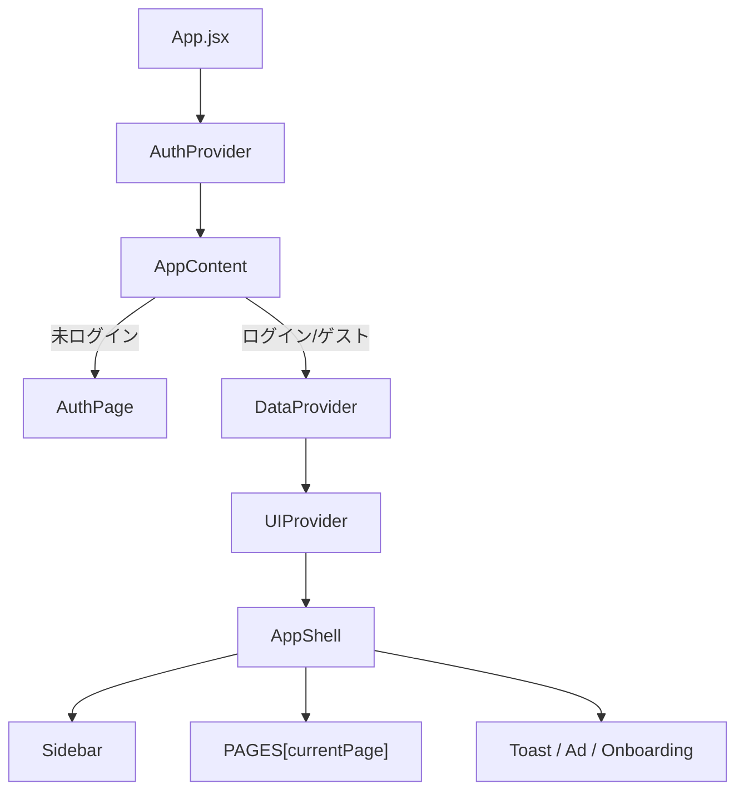
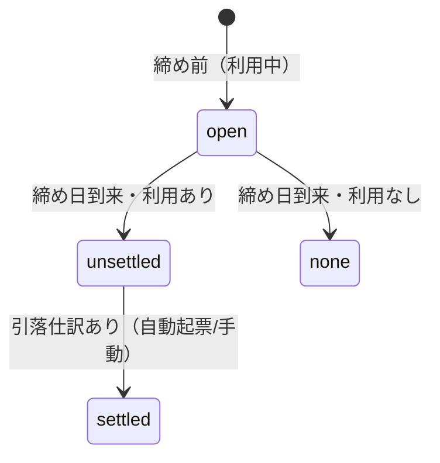
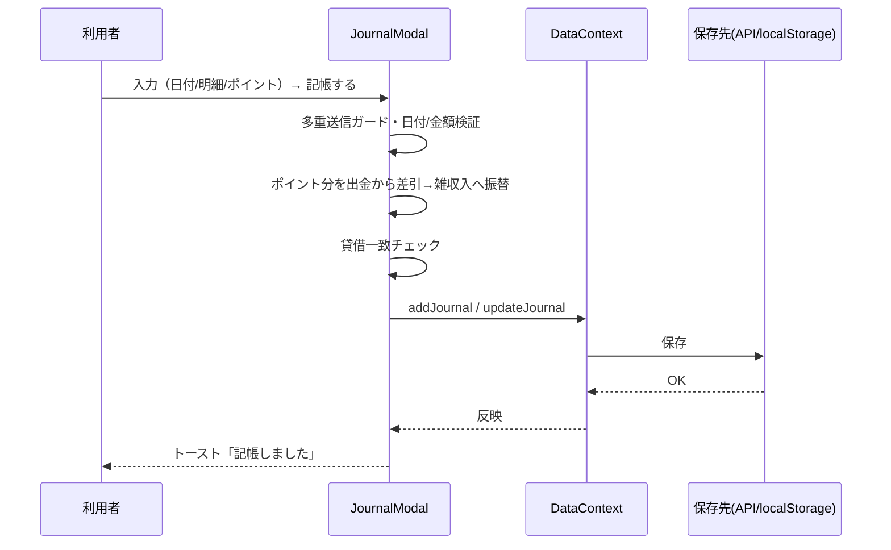
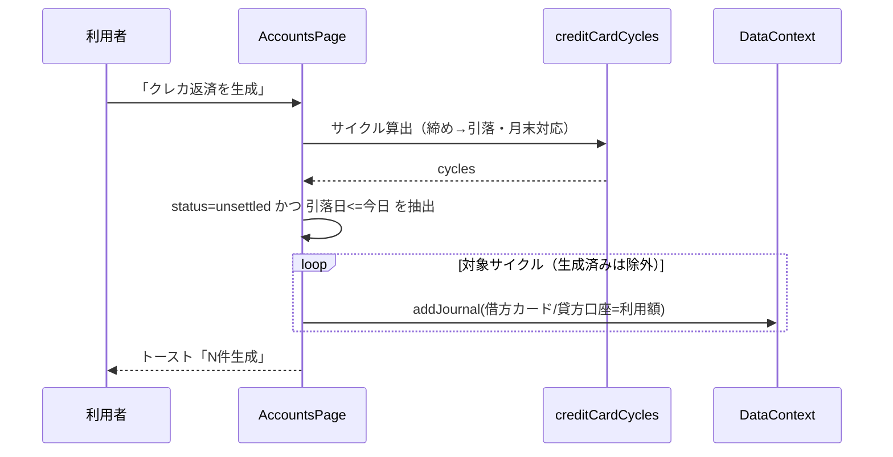
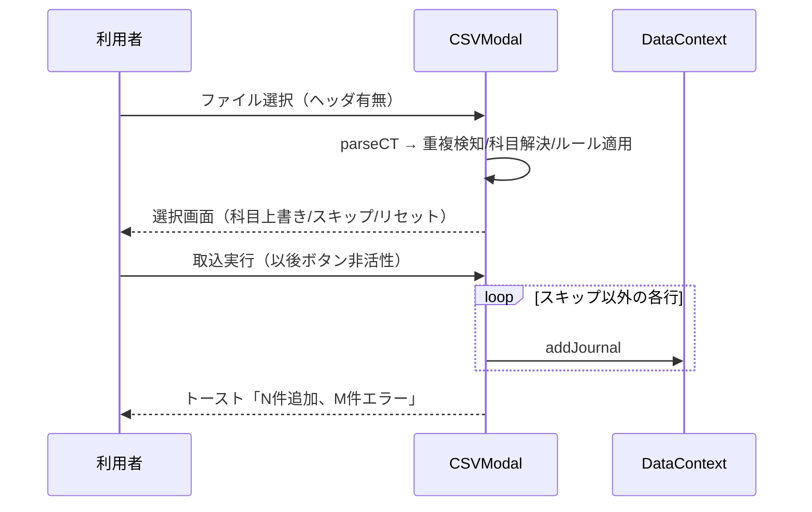
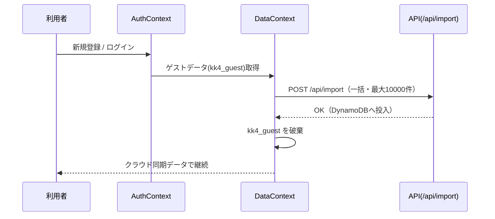

# 黒福簿（kurofukubo） 詳細設計書

| 項目 | 内容 |
|---|---|
| システム名 | 黒福簿（kurofukubo） |
| 文書種別 | 詳細設計書（内部設計） |
| 版 | 1.0（2026-06-14 時点） |
| 関連文書 | `基本設計書.md`／`SPEC.md`／`NEXT_STEPS.md` |
| 対象 | `frontend/`（React+Vite）＋ `backend/`（AWS SAM） |

---

## 1. アーキテクチャ詳細

### 1.1 全体方針
- **計算はクライアント完結**（残高・BS/PL/CF・クレカサイクル）。API は永続化のみ。
- データ層は `DataContext` が **API（DynamoDB）** と **localStorage** を自動切替（Cognito未設定/ゲスト時は localStorage）。

### 1.2 フロントのレイヤ

- ルーティングは `UIContext.currentPage` を `App.jsx` の `PAGES` マップで対応コンポーネントに解決（URLルータは使わずSPA内状態遷移）。

### 1.3 フォルダ構成（主要）
```
frontend/src/
  App.jsx, main.jsx, styles/global.css
  contexts/   AuthContext.jsx, DataContext.jsx, UIContext.jsx
  api/        client.js, oauth.js（auth/）
  config/     nav.js, tiers.js
  utils/      format.js, bookkeeping.js, creditCard.js, csv.js, pdf.js
  components/
    Layout/   Sidebar.jsx, AuthPage.jsx
    Dashboard/Dashboard.jsx, PieChart.jsx, TrendChart.jsx, PeriodBar.jsx, BudgetPanel.jsx
    Journal/  JournalPage.jsx, JournalModal.jsx, QuickEntry.jsx, CSVModal.jsx, SplitModal.jsx
    Credit/   CreditPage.jsx, CycleBars.jsx
    Ledger/   LedgerPage.jsx
    Calendar/ CalendarPage.jsx
    Reports/  BSPage.jsx, PLPage.jsx, CFPage.jsx
    Accounts/ AccountsPage.jsx, AccountModal.jsx, RuleModal.jsx, WalletModal.jsx, PresetModal.jsx
    Tags/     TagsPage.jsx, TagModal.jsx
    Recurring/RecurringPage.jsx, RecurringModal.jsx
    Settings/ SettingsPage.jsx, BudgetModal.jsx
    Onboarding/OnboardingModal.jsx, SetupChecklist.jsx
    Common/   Modal.jsx, Toast.jsx, ErrorBoundary.jsx, InfoTip.jsx, EmptyState.jsx,
              Ad.jsx, AdBanner.jsx, Guest.jsx, ExportMenu.jsx, ReportPrintHeader.jsx
```

### 1.4 状態管理（Context）
| Context | 主な提供物 |
|---|---|
| AuthContext | isAuthenticated, devMode, guestMode, tier, signIn/Out, forgotPassword/confirm, loginAsGuest/exitGuest, deleteAccount, OAuth(state+PKCE) |
| DataContext | accounts, journals, tags, wallets, budgets, presets, recurring, rules, allocs ＋ add/update/delete系。保存先（API/localStorage）を内部で切替 |
| UIContext | currentPage, navigate, hiddenNav, toggleNav, isHidden, onboardingOpen, openOnboarding/closeOnboarding |

---

## 2. コンポーネント設計

### 2.1 画面コンポーネント
`App.jsx` の `PAGES` で `currentPage` → コンポーネント解決。

| currentPage | コンポーネント | 主責務 |
|---|---|---|
| dashboard | Dashboard | KPI/円グラフ/予算/月次推移 |
| journal | JournalPage | 仕訳一覧・検索・ソート・一括操作 |
| credit | CreditPage | クレカサイクル・グラフ |
| ledger | LedgerPage | 元帳・エクスポート |
| calendar | CalendarPage | 日別収支・当日仕訳編集 |
| bs/pl/cf | BSPage/PLPage/CFPage | 財務諸表・エクスポート |
| accounts | AccountsPage | 科目/口座/CC返済/ルール |
| tags | TagsPage | タグ・配分 |
| recurring | RecurringPage | 定期取引 |
| settings | SettingsPage | 表示画面/テーマ/予算/退会 |
| guide | （オンボーディング再表示） | — |

### 2.2 共通コンポーネント
| 名称 | 役割 |
|---|---|
| Modal | 汎用モーダル（Escで閉じる/背景クリック/スクロールロック）。`wide` で `.md-w`（最大1040px） |
| Toast | 通知（`useToast()`） |
| InfoTip | 用語ツールチップ（ⓘ） |
| EmptyState | 空状態の案内＋アクション |
| ExportMenu / ReportPrintHeader | エクスポート操作・印刷用ヘッダ |
| Ad / AdBanner | ティア別広告（`AdBanner` を `React.lazy`、ブロック時は枠を畳む） |
| Guest（GuestBanner/RegisterCard/GuestPromoModal） | ゲスト誘導 |

---

## 3. モジュール設計（utils）

### 3.1 `format.js`
| 関数/定数 | 仕様 |
|---|---|
| `fa(n)` | `¥1,234`（絶対値・四捨五入） |
| `fas(n)` | 符号付き `+¥… / −¥…` |
| `esc(s)` | HTMLエスケープ |
| `today()` | 今日 `YYYY-MM-DD`（※ISO。期間計算は bookkeeping の `fmt`/creditCard の `ymd` を使用） |
| `uid()` | 簡易ユニークID |
| `ACCOUNT_TYPES` | {asset:資産, liability:負債, equity:純資産, income:収益, expense:費用} |
| `TAX_RATES` | [0,8,10] |
| `PIE_COLORS` / `TAG_COLORS` | チャート/タグ配色パレット |

### 3.2 `bookkeeping.js`
| 関数 | 入力→出力 | 主ロジック |
|---|---|---|
| `calcBalances(journals, accounts)` | → `{ [accountId]: {dr, cr} }` | 全明細の借方/貸方を科目別に集計 |
| `accountBalance(accountId, accounts, balances)` | → number | 資産・費用は `dr−cr`、それ以外は `cr−dr` |
| `filterByPeriod(journals, start, end)` | → journals | `start≤date≤end` |
| `getPeriodRange(mode, custom)` | → `{start, end}` | month/lastm/last2m/year/all/custom。`fmt` でローカル整形（**JSTオフバイワン是正済み**） |
| `computeTagBalances(journals, accounts)` | → `{accountId:{tagId:amount}}` | split のタグ別集計（符号は科目区分準拠） |
| `monthlyTrend(journals, accounts, months=6)` | → `[{label, income, expense}]` | 直近Nヶ月の収入/支出 |
| `isCashAccount(a)` | → bool | 資産かつ code `^100` or 名称 現金/預金 |
| `computeCashFlow(journals, accounts)` | → `{operating, investing, financing, net, items}` | 現金科目増減を相手科目区分で按分分類（営業/投資/財務） |
| `fmt(d)` | Date→`YYYY-MM-DD` | **getFullYear/Month/Date のローカル整形**（toISOString不使用） |

CF区分判定（`cfCategory`）: 収益/費用→operating、負債/純資産→financing、資産→投資性（code `^1[23]` or 有価証券/固定資産/投資）なら investing 否なら operating。

### 3.3 `creditCard.js`
| 関数 | 仕様 |
|---|---|
| `ymd(d)` / `todayYmd()` | ローカル日付整形 / 今日 |
| `clampDay(y, m, day)` | 当月末日を超える日を末日に丸める（**月末締め対応**） |
| `isCreditCard(a)` | 負債かつ ccClose/ccDay/ccFrom を持つ |
| `isSettlementJournal(j, cardId, assetIds)` | 「カード借方＋資産貸方」＝引落仕訳か |
| `creditCardCycles(card, journals, accounts, cap=36)` | 締め→引落サイクル配列（新しい順）。各 `{periodStart, periodEnd, settleDate, usage, items, status}`。利用ありor締め前のみ返す |
| `creditUsageByCategory(card, journals, accounts, start, end)` | 期間内利用を相手借方科目で集計 `[{accountId,name,value}]`（降順） |

`creditCardCycles` の要点:
- 現在開いている締め月 = 今日が締め日超なら翌月。
- 各サイクル: `periodEnd=clampDay(締め)`, `periodStart=前回締め+1日`, `settleDate=clampDay(締め月+ずれ, 引落日)`。
- `usage` = 期間内の `cr−dr`（引落仕訳は除外）、`items` = 利用明細。
- `status`: `open`(締め前) / `none`(利用なし) / `settled`(引落済) / `unsettled`(未引落)。



### 3.4 `csv.js`
| 要素 | 仕様 |
|---|---|
| `CC` | 列インデックス `{d:0, da:1, dm:2, ca:3, cm:4, ds:5}`（日付/借方科目/借方金額/貸方科目/貸方金額/摘要） |
| `parseCT(text, hasHeader)` | CSV→行配列（hasHeaderで1行目除外） |
| `normD` / `pAm` | 日付正規化 / 金額パース |
| `resolveAccount(accounts, name)` | 科目名→科目ID解決 |
| `readCsvFile(file)` | File→テキスト |
| `rowsToCSV(rows)` / `downloadCSV(name, csv)` | 配列→CSV文字列 / **UTF-8 BOM付き**でDL |

### 3.5 `pdf.js`
| 関数 | 仕様 |
|---|---|
| `downloadElementPDF(el, filename)` | `jspdf`/`html2canvas` を動的 import。一時的にライトテーマ化→画像化→A4複数ページに貼付→`doc.save()`（印刷ダイアログなし） |

---

## 4. 主要処理フロー

### 4.1 記帳（JournalModal.handleSave）
1. 多重送信ガード（`saving`）。
2. 日付形式 `YYYY-MM-DD` 検証。
3. 有効行抽出（科目あり・金額>0）。
4. **ポイント利用**>0 のとき: 最大額の貸方行から差し引き、同額の「雑収入」貸方行を追加、摘要に「（ポイント利用）」付与、0円になった出金行を除去。
5. 借方/貸方の存在・貸借一致を検証。
6. `addJournal`/`updateJournal`。



### 4.2 クレカ返済の自動起票（AccountsPage.generateCC）
1. `creditCardCycles` で各カードのサイクル算出。
2. `status==='unsettled'` かつ `settleDate≤今日` のサイクルを対象。
3. 既存の同settleDate返済仕訳があればスキップ。
4. `借方カード/貸方引落口座 = cy.usage`、摘要「クレカ返済: {名} ({締め月}月締め分)」で `addJournal`。
- ※画面表示（CreditPage）と同一の `creditCardCycles` を使用するため一致。



### 4.3 CSV取込（CSVModal）
1. ヘッダ有無を選択→ファイル読込→`parseCT`。
2. `deriveInitial`: 重複検知（`date|accountId|amount`）・科目解決・ルール適用で借方/貸方初期値を導出。重複は初期スキップ。
3. 行ごとに借方/貸方を上書き可、一括設定・重複一括スキップ/取込・「選択をリセット」。
4. 取込実行: `importing` ガード（**多件数の二重取込防止・ボタン非活性**）。スキップ以外を順次 `addJournal`、エラー行は集計表示。



### 4.4 一括編集（JournalPage）
- 「一括選択」モードON→行クリックで選択。一括編集モーダルで **日付/摘要/借方科目/貸方科目**のうち指定項目のみ各仕訳へ適用（金額不変。科目は dr/cr 行の `accountId` を差し替え）。

### 4.5 ゲスト→本番移行
- 登録/ログイン時、`kk4_guest` のデータを `/api/import`（一括）でDynamoDBへ投入し、ゲストキーを破棄。



---

## 5. データ設計（物理）

### 5.1 localStorage（ゲスト/フォールバック）
キー `kk4_guest` に下記JSON（`kk4` は旧単一HTML版）。
```json
{
  "accounts": [{ "id":"a01","code":"1001","name":"現金","type":"asset","sys":1 }],
  "journals": [{ "id":"x","date":"2026-06-01","desc":"スーパー",
    "lines":[{"accountId":"e01","side":"dr","amount":1200,"taxRate":0},
             {"accountId":"a01","side":"cr","amount":1200,"taxRate":0}] }],
  "tags": [], "wallets": [], "budgets": [], "presets": [],
  "recurring": [], "rules": [], "allocs": []
}
```
- 負債科目のCC設定: `ccClose, ccDay, ccDelay, ccFrom` を account に付与。
- 明細のタグ配分: `line.splits = [{tagId, amount}]`。

### 5.2 DynamoDB（シングルテーブル）
- PK: `USER#<cognito-sub>`、SK: `JOURNAL#<id>` / `ACCOUNT#<id>` / `TAG#<id>` / 設定系。
- GSI1: PK同一、GSI1SK=date（仕訳の日付検索）。
- **テナント分離**: PKがユーザー単位のため、他ユーザーのデータへ到達不可（設計で保証）。
- 詳細は `docs/DATA_MODEL.md`。

---

## 6. API設計

API Gateway（REST）+ Lambda。`api/client.js` が Cognito トークンを自動付与。

| メソッド/パス | 機能 | 主検証 |
|---|---|---|
| `GET/POST/PUT/DELETE /api/journals` | 仕訳CRUD | 借貸一致、`sanitizeLines`（行ホワイトリスト、MAX_LINES=100、MAX_SPLITS=50）、`date`=`YYYY-MM-DD`、摘要 ≤200 |
| `GET/POST/PUT/DELETE /api/accounts` | 科目CRUD | 名称≤100、コード≤30、備考≤300 |
| `/api/settings`（タグ/口座/予算/配分/ルール/定期 等） | 設定系の取得・更新 | タグ名≤100、口座名≤100、デフォルトタグ名≤50、備考≤300 |
| `POST /api/import` | 一括インポート（ゲスト移行） | 件数上限 10000 |
| エクスポート | サーバー側エクスポート（settings配下） | — |
| `DELETE /api/account` | アカウント削除 | Cognito AdminDeleteUser |

- スロットリング: 25 rps / バースト 50（API Gateway MethodSettings）。
- 認可: Cognito オーソライザ→JWTの `sub` を userId として全クエリのPKに使用。

---

## 7. バックエンド設計（backend/）

| ファイル | 役割 |
|---|---|
| `template.yaml` | Cognito / API Gateway / Lambda / DynamoDB（SAM） |
| `lib/db.js` | シングルテーブルヘルパー |
| `middleware/apiHelper.js` | レスポンス整形、JWTからuserId抽出、`tooLong()` 長さ検証 |
| `handlers/journals.js` | 仕訳CRUD＋借貸一致＋`sanitizeLines` |
| `handlers/accounts.js` | 科目CRUD＋長さ検証 |
| `handlers/settings.js` | タグ/口座/予算/エクスポート/インポート、`DELETE /api/account`（USER_POOL_ID＋AdminDeleteUser権限） |
| `handlers/postConfirm.js` | 新規登録時にデフォルト科目を投入、テーマ初期値 `light` |

---

## 8. 認証・認可

- **メール**: Cognito SRP。パスワード再設定（forgot/confirm）。
- **Google**: Cognito Google IdP + OAuth Authorization Code + PKCE（`auth/oauth.js` が state/PKCE管理）。
- **ゲスト**: `kk_guest='1'` でゲスト状態。API非使用。
- **テナント分離**: DynamoDB PK=`USER#<sub>`。サーバーは常にJWTの sub でアクセス。

---

## 9. エラーハンドリング / バリデーション

| 層 | 内容 |
|---|---|
| 入力（クライアント） | maxLength（摘要100/名称50/コード20/備考200）、日付形式、貸借一致、金額>0、ポイント≤出金 |
| 多重実行防止 | 記帳（`saving`）、CSV取込（`importing`）、クレカ生成（`genBusy`） |
| サーバー | `sanitizeLines`/`tooLong`、件数上限、借貸一致 |
| 通知 | `Toast` で成功/失敗を表示。例外時は保存失敗トースト |

---

## 10. 設定・定数

| 定義 | 値 |
|---|---|
| ナビ（`config/nav.js`） | メイン/レポート/管理。core=dashboard,journal,settings（非表示不可） |
| ティア広告（`config/tiers.js`） | guest: navEvery 3＋サイドバー/ダッシュ/元帳、free: navEvery 6、pro/family: なし |
| ゲスト上限 | tags/wallets/accounts 各5 |
| 税率 | 0/8/10 |
| 広告env | `VITE_ADSENSE_CLIENT` / `VITE_ADSENSE_SLOT`（未設定で非表示） |

---

## 11. ビルド・デプロイ・検証

### 11.1 開発
```
cd frontend && npm install && npm run dev   # http://localhost:3000（使用中なら3001）
```

### 11.2 ビルド & 本番デプロイ（フロント）
```
cd frontend && npm run build
aws s3 sync dist s3://<app-bucket> --delete --profile kakeibo-prod
aws cloudfront create-invalidation --distribution-id <dist-id> --paths "/*" --profile kakeibo-prod
```
- AWS CLI は **PowerShell 側**で実行（SSOキャッシュの都合）。トークン切れ時 `aws sso login --profile kakeibo-prod`。
- バックエンドは `sam build` → `sam deploy --no-execute-changeset …` → changeset確認 → `execute-change-set`（**盲目的deploy禁止**）。

### 11.3 バックエンド（変更時）
- `backend/` で `sam build` → changeset確認 → 実行。リージョン `ap-northeast-1`。

### 11.4 E2E検証（Playwright）
- `docs/design-gen/verify-*.mjs`: ゲストモードにデモデータを注入し各機能を検証。
  - 例: `verify-credit.mjs`（サイクル/期間）、`verify-point.mjs`（ポイント→雑収入）、`verify-ccgen.mjs`（自動起票）、`verify-batch.mjs`（ソート/一括/期間ラベル/カレンダー）、`verify-csvshot.mjs`（CSV）。
- `shoot.mjs`: 全画面スクショ（`shots/`）。
- 実行: `APP_URL=http://localhost:3001/ node verify-xxx.mjs`（本番確認は `APP_URL=https://app.kurofukubo.com/`）。

---

## 12. 既知の制約・今後

- 課金（Stripe）未実装＝全ログインユーザー Free 相当。
- AI仕分け未実装（同意チェック前提）。
- CSP 未適用（AdSense/Cognito 許可リスト整備後）。
- SES 本番アクセス申請は保留。
- 旧 `kakeibo.html` は参照実装として残置。
